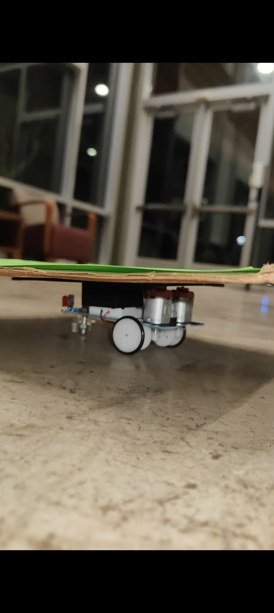
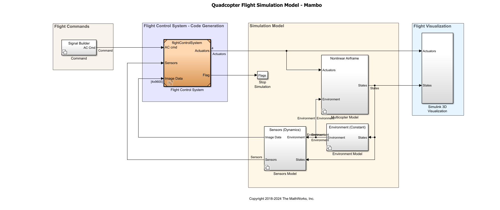
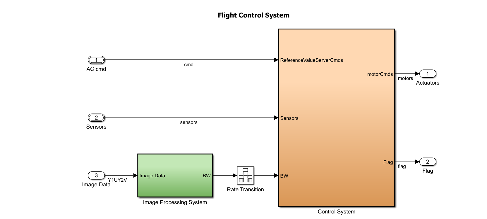
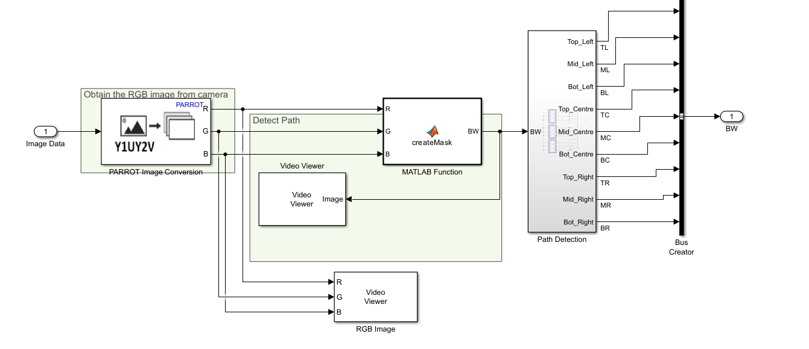
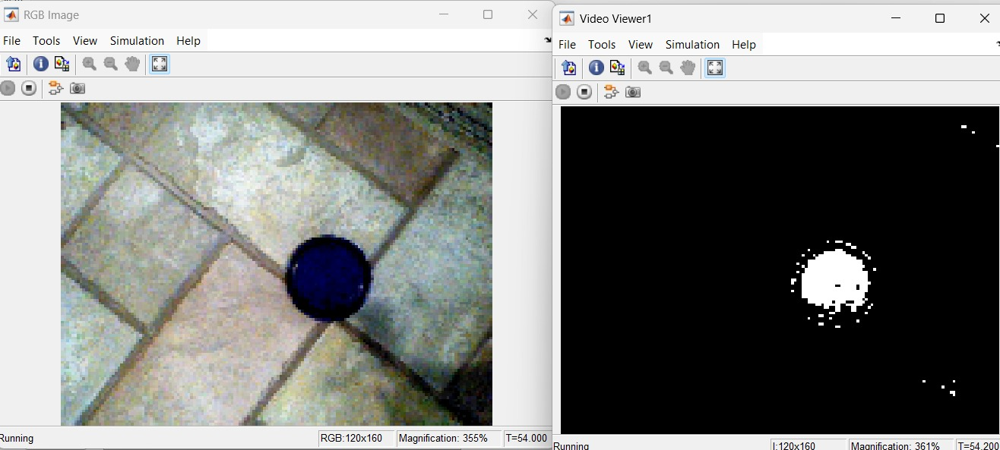
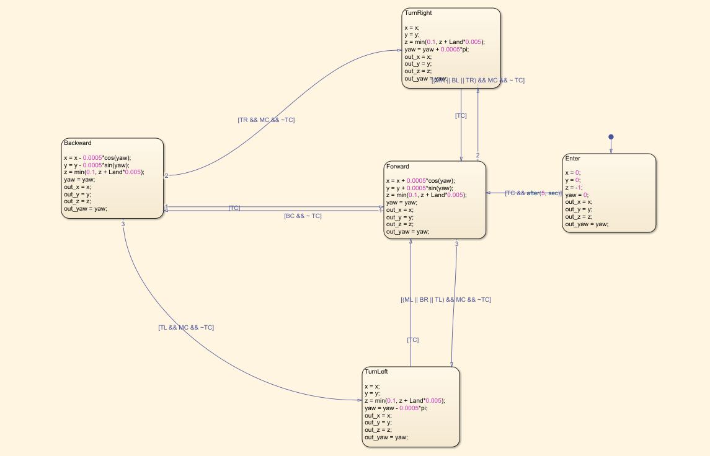

# Minidrone Autonomous Landing

Autonomous flight system for the Parrot Mambo minidrone that follows a color-marked path and lands on a moving wheeled target. Fully designed, simulated, and deployed in MATLAB/Simulink with generated C code running directly on the drone hardware.

---

## Demo

<p align="center">
  
</p>

---

## Moving Target

The landing platform is a motorized wheeled cart with a green surface. The drone uses its downboard camera to detect the green color, follow the platform, and descend onto it.

<p align="center">
  
</p>

---

## System Architecture

The top-level model feeds flight commands and sensor data into the `flightControlSystem`, which runs the image processing and control loops, then drives the nonlinear airframe simulation.

<p align="center">
  
</p>

---

## Flight Control System

The flight controller has three inputs: trajectory commands, sensor data, and raw camera image. The **Image Processing System** converts the camera feed into a binary mask and passes it to the **Control System**, which computes per-motor commands.

<p align="center">
  
</p>

---

## Image Processing Pipeline

The downward camera frame is converted from Parrot raw format to RGB, then a `createMask` MATLAB function thresholds the green color channel. The binary output is divided into **9 spatial zones** (Top/Mid/Bot × Left/Centre/Right), giving the controller directional awareness of where the target is relative to the drone.

<p align="center">
  
</p>

The left window shows the raw RGB camera feed; the right shows the binary mask output — the target isolated as a white blob on black.

<p align="center">
  
</p>

---

## Navigation State Machine

A Stateflow chart uses the 9-zone binary mask to decide motion. The drone starts in **Forward** and transitions between **TurnLeft**, **TurnRight**, and **Backward** based on which zones contain green. The altitude reference `z` increments by `Land * 0.005` each step — the drone descends gradually as it centers over the target until landing.

<p align="center">
  
</p>

| State | Condition |
|---|---|
| Forward | Target centered (TC active, MC clear) |
| TurnRight | Target to the right (BL or TR active, MC clear) |
| TurnLeft | Target to the left (TL active, MC clear) |
| Backward | Target behind center (BC active, TC clear) |
| Land | TC active, centered — descend |

---

## Hardware

| Component | Details |
|---|---|
| Platform | Parrot Mambo minidrone |
| Sensors | IMU (accel + gyro), barometer, sonar, downward camera |
| Moving target | Motorized wheeled cart with green landing surface |
| Interface | MATLAB Aerospace Toolbox — Parrot support package |

---

## Software

| Layer | Technology |
|---|---|
| Modeling & simulation | MATLAB / Simulink |
| Vision | Color thresholding, 9-zone spatial segmentation |
| Navigation logic | Simulink Stateflow state machine |
| Control design | Linearized state-space, cascaded PID |
| State estimation | IMU Kalman filter, complementary filter, altitude KF |
| Flight code generation | Simulink Coder → Parrot target |

---

## Repository Structure

```
minidrone-autonomous-landing/
├── controller/
│   └── flightControlSystem.slx      # Main flight control system
├── mainModels/
│   ├── parrotMinidroneCompetition.slx  # Top-level simulation model
│   ├── cmdData.mat / cmdData.xlsx      # Command trajectory data
│   └── sensorCalibration.mat
├── linearAirframe/
│   ├── linearAirframe.slx           # Linearized airframe model
│   ├── trimLinearizeOpPoint.m        # Trim & linearize script
│   └── trimNonlinearAirframe.slx
├── nonlinearAirframe/
│   └── nonlinearAirframe.slx        # Full nonlinear airframe model
├── libraries/
│   ├── dynamicsLibrary.slx          # Dynamics block library
│   └── environmentLibrary.slx       # Environment block library
├── tasks/
│   ├── controllerVars.m             # Controller tuning parameters
│   ├── estimatorVars.m              # State estimator parameters
│   ├── vehicleVars.m                # Vehicle physical parameters
│   └── sensorsVars.m                # Sensor model parameters
├── utilities/
│   ├── startVars.m                  # Project startup script
│   ├── generateFlightCode.m         # Code generation script
│   └── drone_track_builder.mlapp    # Competition track builder app
├── media/
│   ├── demo.gif                     # Flight demo
│   ├── target_platform.jpeg         # Moving target hardware
│   ├── simulink_top_level.png       # Top-level model diagram
│   ├── flight_control_system.png    # FCS diagram
│   ├── image_processing_pipeline.png
│   └── navigation_stateflow.png
├── support/                         # 3D visualization assets (VRML)
├── demo.mp4                         # Full flight demo video
├── report.docx                      # Project report
└── MinidroneCompetition.prj         # MATLAB project file
```

---

## Getting Started

**Requirements:** MATLAB R2023b or later, Simulink, Aerospace Toolbox, Parrot support package.

```matlab
% 1. Open the project
open('MinidroneCompetition.prj')

% 2. Initialize workspace variables
run('utilities/startVars.m')

% 3. Open the main simulation model
open_system('mainModels/parrotMinidroneCompetition.slx')

% 4. Run the simulation
sim('mainModels/parrotMinidroneCompetition.slx')
```

To generate and deploy flight code to the Parrot hardware:

```matlab
run('utilities/generateFlightCode.m')
```

---


